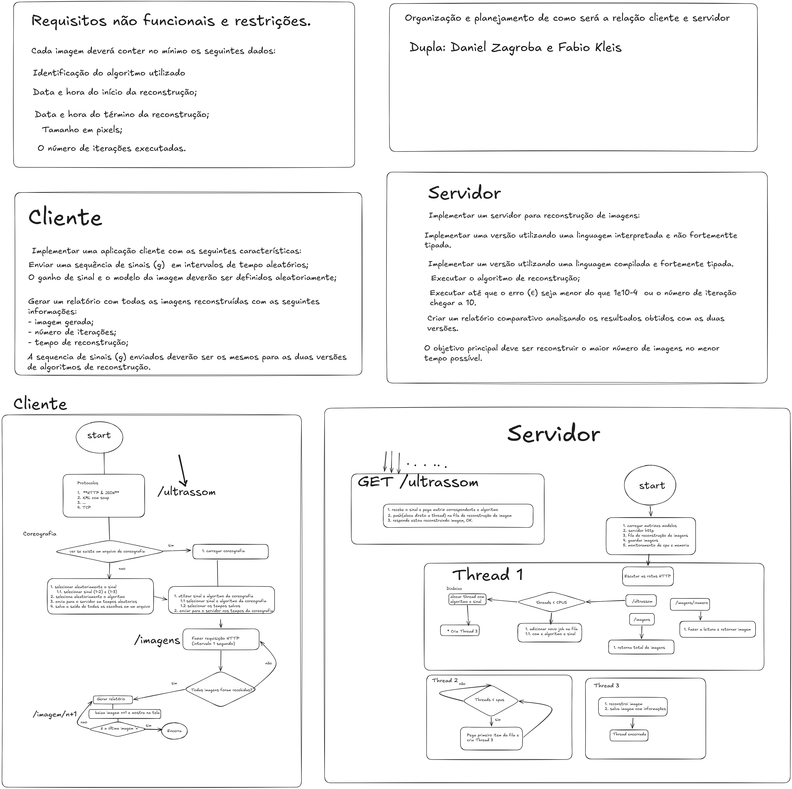

# dis-ultrassom

Trabalho da disciplina ICSM31 - Desenvolvimento Integrado de Sistemas

## Planejamento


## Setup
utilize o nix para instalar as dependencias do projeto: https://nixos.org/download/
ou instale as dependencias c++ manualmente:
* **Armadillo**: https://arma.sourceforge.net/
* **CMake**: https://cmake.org/download/
e **pkg-config**: > instale via o gerenciador de pacotes da sua distro
* **doctest**: https://github.com/doctest/doctest/blob/master/doc/markdown/build-systems.md

o projeto foi construido com as seguintes ferramentas do ecossistema python:

* **[NixOS (shell.nix)](https://nixos.org/)**
* **[uv](https://github.com/astral-sh/uv)**
* **[Ruff](https://docs.astral.sh/ruff/)**
* **[Pytest](https://docs.pytest.org/)**

no terminal, na raiz do repositório, execute:
```bash
nix-shell
```

uma vez dentro do shell do nix todas as bibliotecas e clis necessarias para compilacao 
estarao disponiveis.

## Build
o projeto usa cmake para fazer a compilacao, fazer o link, e para compilar execute:
```bash
mkdir -p build
cmake ..
make
```

## Tests
foi configurado o doctest para testes unitarios, para executar no terminal:

```bash
./run_tests
```

## Run
ao fim da compilacao deve ser gerado um binario `dis`, execute no terminal:
```bash
./dis
```

## Clean
dentro do diretorio `build` pode ser removido os arquivos de build:
```bash
make clean
```
ou limpar tudo:
```bash
rm -rf * # garanta q esta em build antes de fazer isso
```
